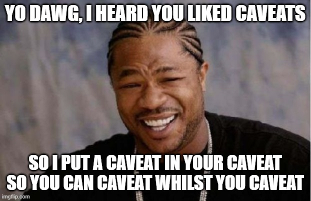

<div align="center">

# no-honest-caveat



### A caveat is a defect you found, understood, priced,<br>and typed out instead of repaired.<br>You already did the expensive part. Finish.

[](https://github.com/valentinozegna/no-honest-caveat/actions/workflows/test.yml)
[](LICENSE)
[](https://skills.sh/valentinozegna/no-honest-caveat)

</div>

You know the ending. The agent works for twenty minutes, ships something good,
then closes with **"one honest caveat"**, **"worth flagging"**, **"Say the word
and I'll fix it"**. It diagnosed the problem correctly. It knew the repair. It
typed the repair into a sentence and handed the sentence back to you.

You typed "yes". You always type yes.

## What it does

It gives your agent one gate to pass before it closes a response:

<div align="center">

### *Can I resolve this now, with the tools and access I already have?*

**YES** → resolve it, and never mention it.<br>
*A repaired defect is not news.*

**NO** → one flat sentence in the body.<br>
*No header, no "honest", no question mark.*

</div>

Before:

```
Migration complete, all forty tables moved cleanly.

One honest caveat: the rollback path is untested. Building a fixture would
take about fifteen minutes. Say the word and I'll cover it.
```

After:

```
Migration complete, all forty tables moved cleanly. Rollback verified
against a scratch database, 0 failures.
```

Same agent, same fifteen minutes, one less round trip through you.

The skill teaches the gate. A **Stop hook** enforces it: if the closing
paragraph still defers work the agent could have done, the turn is blocked and
the phrase is named.

```
no-honest-caveat: your close hands unfinished work back to the user.

  "Say the word" -> You already know the fix. Apply it.
  "One honest caveat" -> Close the gap instead of naming it.
  "untested" -> Build the fixture and run it.
```

Three things still get said, once and flatly: **a decision you own** (scope,
money, anything irreversible), **a wall it cannot climb** (missing hardware, a
dead API), and **bias in its own measurements**. Deleting data, pushing to a
remote, sending mail: it still asks, always.

It will never claim a finish it did not reach. A false completion is worse than
a caveat, because a caveat is at least true.

## Install

**Skills CLI** (Claude Code, Cursor, Codex, Copilot, Gemini, and the rest):

```bash
npx skills add valentinozegna/no-honest-caveat
```

**Claude Code plugin**, which adds the Stop hook and the slash command:

```
/plugin marketplace add valentinozegna/no-honest-caveat
/plugin install no-honest-caveat
```

**Any other agent**: copy `rules/no-honest-caveat.md` into whatever file your
agent reads. It already ships at every common path (`AGENTS.md`, `GEMINI.md`,
`.cursor/rules/`, `.clinerules/`, `.github/copilot-instructions.md`, and more).

## How bad is it, really

Nobody has ever written "one dishonest caveat". The adjective is not describing
the caveat, it is describing the author. There is a name for a colleague who
diagnoses your problem, prices the repair, writes it all up, then asks whether
you would like them to proceed. The name is *consultant*. You did not hire a
consultant.

Count your own. Read-only, nothing leaves your machine:

```bash
npx -y github:valentinozegna/no-honest-caveat
```

It reads your transcripts, ranks the phrases your agent closes with, highlights
the offending sentence in each one, and tells you how often the question
carried any information. On the transcripts this was built from: 487 deferring
closes, and 70 of the 81 that got an answer ended in "yes".

## Develop

```bash
npm test                            # 18 tests
node scripts/build-rules.js         # regenerate the agent rule copies
node scripts/build-rules.js --check # verify they are in sync
node scripts/audit.js [dir]         # audit any transcript directory
```

Edit the rule in `rules/no-honest-caveat.md`, then run the build. A test fails
if the copies drift.

## Turning it off

```
stop no-honest-caveat
```

MIT.
